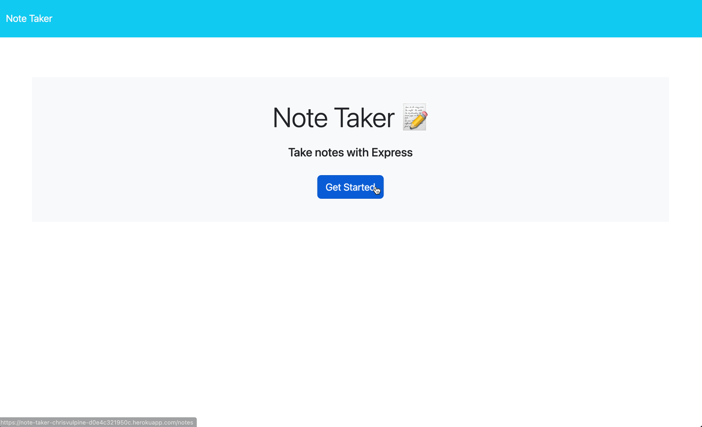

# Note Taker 

## Description
This application will allow a user to take notes and save them locally on their device allowing them to stay more organized.

## Table of Contents

- [Application](#application)
- [License](#license)
- [Credits](#credits)
- [Questions](#questions)

## Application
The application can be found here: [Note Taker App](https://note-taker-chrisvulpine-d0e4c321950c.herokuapp.com/)

## License
This project is covered under the [MIT](https://opensource.org/licenses/MIT) license.
  
  

## Credits

* Routing in Node - https://www.geeksforgeeks.org/routing-in-node-js/#
 
* Express Routing - https://expressjs.com/en/guide/routing.html
 
* chatGPT - https://chatgpt.com/
 
* General Reference - https://www.w3schools.com/

## Questions
Got questions? Use the info below to contact me! 
GitHub: [@chrisvulpine](https://github.com/chrisvulpine/)

Email: [chrisleach1191@gmail.com](mailto:chrisleach1191@gmail.com)
